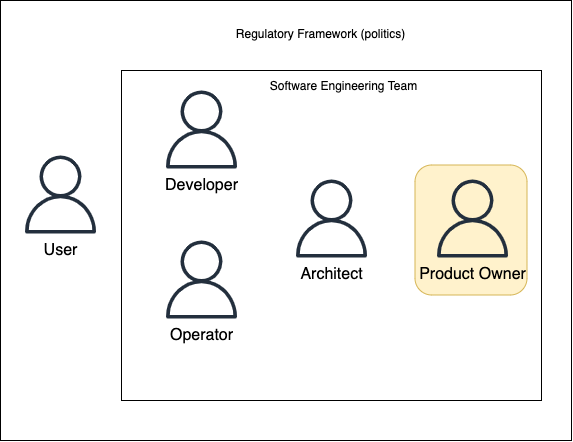

# Roles, Sustainability & Responsibility 

# User perspective

- User procurement decisions unlikely affected by individual cost of energy consumption for updates
- Update availability (cadence) and user experience (update duration, background installation vs. requiring restarts) are paramount
- __Better quality software__ -> less need for patch updates
- __Higher performance update__ process -> quicker installation__ times
- Demand sustainability by leveraging exisiting forms of functional and non functional requirements 
- Communicate requirement transparency to vendors

_As a user_    
_I want_    
my updates to be 

- quick
    - Network usage (download time)
    - CPU + IOPS usage (installation time)

- lightweight 
    - My device remains usable for other tasks while the update installs 
    - Mobile data usage
    - energy consumption heat, battery usage, fan noise

- frequent 
    - early availability of new features
    - prevent premature end of life (compatiblility & security patches)

- not _too_ frequent
    - "Participants report common unexpected restarts, while half also reported growing concern about the state of the device if an update took a long time" 

- Case Study Windows Update
    - "Back to the envelope" estimation of the resource consumption impact. Assumptions
    - Average installation duration: 10 minutes 
    - Average energy consumption: 50 Watt * 10 mins = 8.33 Wh
    - Update requires a restart, PC is unusable for other tasks: exclusive energy consumption, 100% attributable to update process
    - One update per month: 8.33 Wh *12 = 100 Wh per year 
    - Devices running Windows 10: 100 Wh *1.3*10^9 = 130 Gwh per year
    
- CO2 equivalent: 
    - 92.129 t CO2e
    - 20.036 (approx.) passenger vehicle cars driven for a year
    - Energy consumption: 100 Wh*30ct/kWh = 3ct
    - Lost productivity per year: 12*10 min = 2h=> 2h*15 (EU)/h = 30 EU

# Architects perspective

_As an Architect_   
_I want_   
to set the principles so the software fulfils

- Functional requirements
    - Correct computation of updates available to a client  
- Non functional requirements
    - 99.9% availability of the update services
    - Scalability: Cost efficient use of infrastructure 
    - Performance target: maximum update installation time (incl. request, download and installation on client) 

Architects can include sustainability in non functional requirements of the architecture
- __Scalability:__ Scale the service up and down in line with demand
- __Performance:__ Response time in SLA

- __Techniques:__ 
    - Break up services to have clear scaling factors allows independently scaling each factor and achieving better resource utlization
    - Leverage optimized hardware

## Using CDN for Sustainable software engineering
- Advantages of using CDN
    - Packets travel shorter distances (faster, less energy)
    - Network requires less total bandwidth and therefore less infrastructure 
    - CDN provider maintains high utilization through caching of most popular content

## Bin packing problem
- Pack items of different sizes into finite number of bins of a fixed given capacity while minimizing the number of bins used 
- Applied to infrastructure: pack virtual machines or containers on physical hardware to maximise utilization 
- Computational complexity of the Bin packing problem is NP hard

- Smaller/more fine granular items lead fragmentation and more optimal solutions
- Delegating bin packing decisions to lower levels can increase overall efficiency 
- Requires collaboration of all involved stakeholders
    - Architects: service architecture (e.g. monoliths vs. microservices)
    - Developers: Tech Stacks and runtime behaviour 
    - Operators: Packaging Solutions (serverless, containers, VMs)
    - Infrastruture Providers: Optimize hardware utilization

- __Solution:__
    - Define non-functional requirements that help achieve better sustainability [3]
    - Design an energy efficient IT-architecture
        - Break up services by resource scaling factors (potentially: micro-services)
        - Ensure services can scale up and down
        - Collaborate for efficient bin packing 

# Developer perspective

_As a Developer_   
_I want to fulfil_
- Functional requirements & Non functional requirements same as architects
- Set a high bar for non-functional requirements 
- High performance typically implies better energy efficiency 
    - programming language, e.g. C++ over Python
    - Libraries/ frameworks with better algorithms e.g. O(log N) vs O(N)
    - protocols and data-formats, e.g. Protobuf over JSON
    - efficient patterns, e.g. event-driven logic vs polling
- Consider impact on infrastructure when choosing technolgies and application services
    - Common example: leveraging an existing database service as a lightweight message queue 
    - Smaller/ more fine granular items lead to less fragmentation and more optimal solutions 
    - Delegating bin packing decisions to lower levels can increase overall efficiency 
    - Requires collaboration of all involved stakeholders
        - Architects: Service Architecture (e.g. monoliths vs. microservices)
        - Developers: Tech stack and runtime behaviour
        - Operators: Packaging Solutions (serverless, containers, VMs)
        - Infrastructure Providers: Optimize hardware utilization 

- Tech stack example: 
    - Java Virtual Machine (JVM)
        - Just-in-time (JIT) compilation benefits from larger process granularity (code caches, optimization passes)
        - Efficient garbage collector implementations enable large heap sizes 
        - Native threading model allows taking advantages of multiple CPU cores easily 
    - Python 
        - Interpreted language, very small memory overhead possible
        - Memory management uses reference counting
        - Global Interpreter Lock (GIL) limits possible concurrency 

- Tech stack influence runtime behaviour - critical enabling lower levels to make efficient infrastructure decisions, e.g. serverless
- Decoupling applications from infrastructure enables better sustainability by taking advantage of independent advancenments in infrastructure
- Applications adhering to 12 Factor principles https://12factor.net/ give operators freedom to design efficient infrastructure (e.g. process model enables auto-scaling)
- Practical examples multi-cloud strategy: applications targeting Kubernetes can be easily moved to a new cluster
    - Move to a green cloud provider or re-patriate workloads to a private cloud 
- "You can't manage what you can't measure" 
- Sustainability is hard to measure - but adherence to functional and non functional requirements is not 
- Instrumentation: adding measurements like metrics and logs to software as a runtime behaviour (not just dedicated tests)
- Developers make instrumentation decisions: what to measure, how to measure
    - Make functional metrics available (e.g. number of updates served)
    - Make non-functional metrics available (e.g. total update download time)
    - Good KPIs are ratios, e.g. of infrastructure and functional metrics 
        - CPU hours used/ # of updates served 
- Software consumes resource not only when used, but also during developement
- Techniques to reduce waste
    - Build the right thing, and build it right
    - Anticipate maintenance concerns (Toolchains, Dependency Management)
    - CI/CD: incremental builds and efficient tests
- Beware of Developer Experience vs runtime tradeoffs

# Operator perspective

- Engineering applications to make efficient use of physical infrastructure is a pillar of sustainable software engineering (like DevOps)
- Provide infrastructure using platforms that support tight bin packing (e.g. Virtualization, Container Orchestration)
- Track infrastructure KPIs (CPU Usage, Memory, Storage..) vs. Business KPIs (e.g. RTT) and automate scaling auto-scaling
- Designing Storage Hierarchy I 
    - Leverage the storage hierarchy - minimize work by keeping data as local as possible
        - Ensures higher performance
        - Reduced hardware footprint 
        - Reduced energy consumption
- Designing Storage Hierarchy II
    - Scale out for performance & availability using a traditional database on virtual infrastructure 
    - Data durability maintained at the storage layer
    - Database topology maintained externally (sharding, replication, node loss etc.)
- Designing Storage Hierarchy III
    - Scale out for performance & availability using a cloud native database
    - Data durability maintained at the database cluster layer using replication 
    - Database is topology aware and handles changes dynamically 
- Lean Operations
    - Backups
        - Simple backup strategies (e.g. daily full backup) can easily eclipse operational data processing volume, approaching [O(N2)](big-o-notation.md). 
    - Logs
        - Maintain high signal to noise ratios
        - Leverage structured logging to avoid unnecessary [format -> transport/store -> parse] processing
    - Cron Jobs 
        - Periodic tasks are prone to overuse (does the job need to run on weekends?) 

# Leader perspective

As a Product Owner   
I'm responsible for   
the product and the process it gets built by

- Proxy for the customers and users of the product
- Make decisions on priority (e.g. by sorting a backlog of user stories)
- Budget (time & cost)
- Ensure good requirements engineering process that enables the team to meet functional and non-functional requirements 

- Leaders need to resolve Software Engineering goal conflicts by creating goal alignment between stakeholders
- Example 
    - Designing for scalibility saves cost, improves quality to users and is more sustainable by freeing unused resources
- Methods 
    - Fostering transparency of KPIs (Infrastructure used vs. Business Performance delivered) enables better engineering decision making

__Pitfals__
- Example: IT as a Cost Center
    - Annual or quaterly chargeback cycles leads to lack of feedback for software engineering teams
    - Split responsibility for incurring vs. bearing cost leads to "shared irresponsibility"
    - No incentive to save cost and resource consumption (apart from annual budget setting)
    - Incentivizing sustainability requires adding a new goal dimension
    
- Example: IT as a Profit Center
    - Monthly chargeback cycles with daily report previews leads to fast feedback cycles for software engineering teams on actual resource spend
    - Unified responsibility for incurring and bearing cost established sense of responsibility 
    - Teams are incentivized to save resources and cost at every opportunity 
    - Incentivizing sustainability aligned with the exisiting "cost" goal dimension

## Selecting infrastructure Responsibly 
- Impact: A/B testing experiment for displaying carbon info in Cloud Console region picker
- Among all users: 19%
- Among new users, more than 50% more likely to select a "low carbon" region when exposed to "Low CO2" in picker

## Key Actions for Leaders
- Create goal alignment good software -> sustainable software
- Involve all stakeholders and set clear goals for your team 
- Review incentives and empower sustainable software engineering

## References
1.  Sustinable Software Enginnering, Johannes Rudolph
2. Morris, J, Becker, I: Parkin, S: (2019) In Control with No Control
3. Raturi, A, Penzenstadler, B., Tomlinson, B. & Richardson, D. (2014, June)